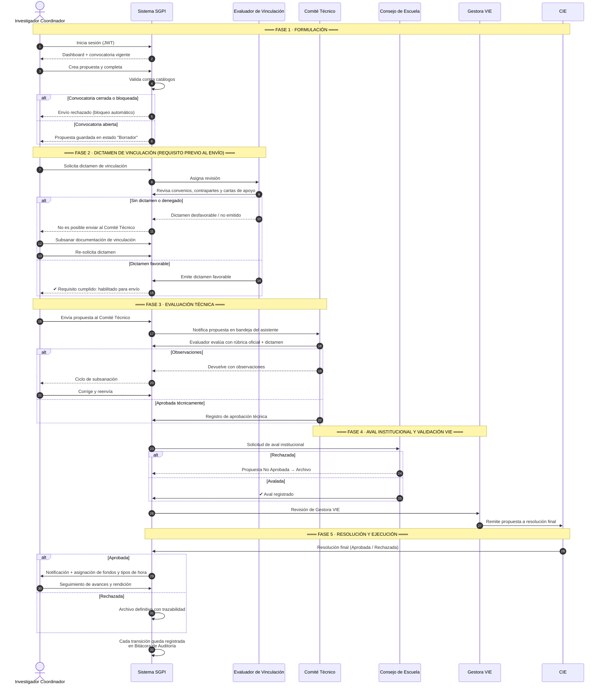

# Diagrama de procesos - SGPI- Gerald Hernandez Gamboa

Este diagrama muestra la interacción general entre los módulos del sistema, ideal para presentaciones y documentación de alto nivel.

```mermaid
sequenceDiagram
    autonumber
    actor IC as Investigador Coordinador
    participant SYS as Sistema SGPI
    participant EV as Evaluador de Vinculación
    participant CT as Comité Técnico
    participant CE as Consejo de Escuela
    participant GV as Gestora VIE
    participant CIE as CIE

    Note over IC,CIE: ═══ FASE 1 · FORMULACIÓN  ═══
    IC->>SYS: Inicia sesión (JWT)
    SYS-->>IC: Dashboard + convocatoria vigente
    IC->>SYS: Crea propuesta y completa
    SYS->>SYS: Valida contra catálogos

    alt Convocatoria cerrada o bloqueada
        SYS-->>IC: Envío rechazado (bloqueo automático)
    else Convocatoria abierta
        SYS-->>IC: Propuesta guardada en estado "Borrador"
    end

    Note over IC,EV: ═══ FASE 2 · DICTAMEN DE VINCULACIÓN (REQUISITO PREVIO AL ENVÍO) ═══
    IC->>SYS: Solicita dictamen de vinculación
    SYS->>EV: Asigna revisión 
    EV->>SYS: Revisa convenios, contrapartes y cartas de apoyo
    alt Sin dictamen o denegado
        EV-->>SYS: Dictamen desfavorable / no emitido
        SYS-->>IC: No es posible enviar al Comité Técnico
        IC->>SYS: Subsanar documentación de vinculación
        IC->>SYS: Re-solicita dictamen
    else Dictamen favorable
        EV->>SYS: Emite dictamen favorable
        SYS-->>IC: ✔ Requisito cumplido: habilitado para envío
    end

    Note over IC,CT: ═══ FASE 3 · EVALUACIÓN TÉCNICA  ═══
    IC->>SYS: Envía propuesta al Comité Técnico
    SYS->>CT: Notifica propuesta en bandeja del asistente
    CT->>SYS: Evaluador evalúa con rúbrica oficial + dictamen
    alt Observaciones
        CT-->>SYS: Devuelve con observaciones
        SYS-->>IC: Ciclo de subsanación 
        IC->>SYS: Corrige y reenvía 
    else Aprobada técnicamente
        CT->>SYS: Registro de aprobación técnica
    end

    Note over CT,GV: ═══ FASE 4 · AVAL INSTITUCIONAL Y VALIDACIÓN VIE  ═══
    SYS->>CE: Solicitud de aval institucional
    alt Rechazada
        CE-->>SYS: Propuesta No Aprobada → Archivo
    else Avalada
        CE->>SYS: ✔ Aval registrado
    end
    SYS->>GV: Revisión de Gestora VIE 
    GV->>CIE: Remite propuesta a resolución final
    Note over CIE,SYS: ═══ FASE 5 · RESOLUCIÓN Y EJECUCIÓN ═══
    CIE->>SYS: Resolución final (Aprobada / Rechazada)
    alt Aprobada
        SYS->>IC: Notificación + asignación de fondos y tipos de hora
        IC->>SYS: Seguimiento de avances y rendición
    else Rechazada
        SYS->>SYS: Archivo definitivo con trazabilidad
    end

    SYS->>SYS: Cada transición queda registrada<br/>en Bitácora de Auditoría
```